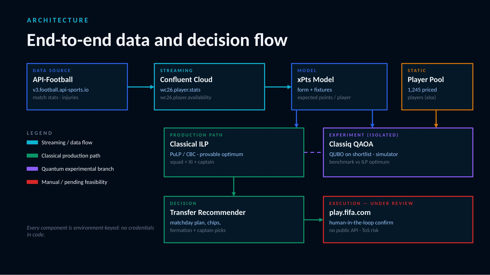

# Quantum World Cup Fantasy Manager

An automated management system for a **FIFA Men's World Cup 2026 Fantasy** team:
it streams live match data, scores players against the official fantasy rules,
models expected points, and selects a constraint-optimal squad — with an
experimental **quantum (QAOA)** optimisation branch alongside the classical one.

Built as an engineering/learning project. The priority was exploring the
data-streaming and quantum-optimisation patterns, not winning the league.

> ⚠️ **Code only.** This repo deliberately ships *no data*. The player pool,
> API responses, and generated CSVs are licensed or personal and are
> `.gitignore`d. Bring your own API key and data — see **Setup**.

---

## How it works



API-Football streams live match statistics into Confluent Cloud (Kafka). A
consumer applies the official FIFA Fantasy scoring rules to produce player
points; these feed an expected-points (xPts) model, adjusted for fixture
difficulty, which both a classical ILP optimiser and an experimental quantum
(QAOA) branch use to select a constraint-optimal squad.

The system reconciles three tiers of data quality — raw API (*bronze*),
stream-derived points (*silver*), and hand-verified official points (*gold*) —
and cross-validates them against each other. That reconciliation is what
surfaces bugs no single source reveals.

---

## Components

| Script | Purpose |
|---|---|
| `fantasy_apifootball_adapter.py` | API-Football v3 adapter; probes + per-fixture stat feed |
| `fantasy_data_feed.py` | Confluent producer; event schemas; dry-run mode |
| `fantasy_name_bridge.py` | Resolves API player names → priced pool rows (accent/order-aware) |
| `fantasy_rnd_points.py` | Joins a round's official points to pool rows |
| `fantasy_rnd_validate.py` | Validates a hand-edited round-points CSV |
| `fantasy_stream_consumer.py` | Consumes Kafka topics, applies official FIFA scoring → points |
| `fantasy_stream_validate.py` | Cross-checks stream-derived vs hand-entered points |
| `fantasy_xpts_model.py` | Form-weighted expected-points model (with a price/role prior) |
| `fantasy_fixture_difficulty.py` | Opponent-strength multipliers (ranking + live form blend) |
| `fantasy_ilp_baseline.py` | Classical squad optimiser (PuLP/CBC) |
| `fantasy_build_squad.py` | Builds the real squad from xPts via the ILP |
| `fantasy_initial_squad.py` | Pre-data heuristic squad (price × team tier) |
| `fantasy_transfer_recommender.py` | Best transfers vs current squad, net of the points hit |
| `fantasy_qaoa_branch.py` | Quantum (QAOA) branch + offline encoding verification |

---

## Setup

**Python 3.12** is recommended (the quantum branch's `classiq` library does not
support 3.13+). The classical pipeline runs on any Python ≥3.10.

```bash
python3.12 -m venv venv312
source venv312/bin/activate          # Windows: venv312\Scripts\activate
pip install -r requirements.txt
```

Provide your own credentials (see `.env.example`):

- **API-Football** key — a paid plan is needed for current-season data.
- **Confluent Cloud** — a Basic cluster, two topics
  (`wc26.player.stats`, `wc26.player.availability`), and a cluster API key.
- **Classiq** (optional) — authenticate interactively; note synthesis needs a
  paid/academic tier.

You also supply a **player pool spreadsheet** (columns: Player Name, Nation,
Position, Price, First/Last Name, Nation Short Code, Nation). Update the pool
path at the top of the scripts to your local file.

---

## Typical run sequence

```bash
# 1. Verify the API and stream data in
python3 fantasy_apifootball_adapter.py probe2 1
python3 fantasy_apifootball_adapter.py feed 1

# 2. Resolve player names → pool rows
python3 fantasy_name_bridge.py live 1 0.83
python3 fantasy_name_bridge.py resolve
python3 fantasy_name_bridge.py apply

# 3. Consume the stream → official-rules points
python3 fantasy_stream_consumer.py --from-start
python3 fantasy_stream_validate.py

# 4. Model expected points (with fixture adjustment)
python3 fantasy_fixture_difficulty.py 1
python3 fantasy_xpts_model.py

# 5. Optimise and recommend
python3 fantasy_build_squad.py
python3 fantasy_transfer_recommender.py 2 100 3

# Quantum branch (offline verification works without synthesis access)
python3 fantasy_qaoa_branch.py
```

---

## The quantum branch

Squad selection is posed as a QUBO and encoded as a QAOA cost Hamiltonian via
Classiq. The **encoding is verified offline**: full enumeration confirms the
Hamiltonian's ground state equals the classical optimum. Circuit *synthesis and
execution* (the depth sweep) require a Classiq tier with synthesis enabled — the
free tier blocks it — so that step is future work. The classical ILP remains the
production path; QAOA is a benchmarked experiment.

---

## Honest limitations

- **Stream scoring is faithful but not perfect.** It matches official FIFA
  points to a mean absolute error of ~0.5 across validated players. Categories
  not present in the stream data (the scouting bonus, which needs ownership
  percentages; tackles; precise free-kick/assist attribution) can't be derived.
- **One round of data is mostly noise.** The model weights recent form lightly
  early and leans on the price/role prior; it calibrates as more rounds arrive.
- **No auto-execution.** Transfers are recommended, not executed — there is no
  public FIFA Fantasy API, and automated play may breach the game's terms.

---

## Status

A work in progress that evolves through the tournament. Built collaboratively,
with a guiding discipline: *check the actual data before building* — verify
against reality rather than assume.

## License

MIT (code only). Third-party data (API-Football, FIFA Fantasy) is subject to its
own terms and is not included or licensed here.
